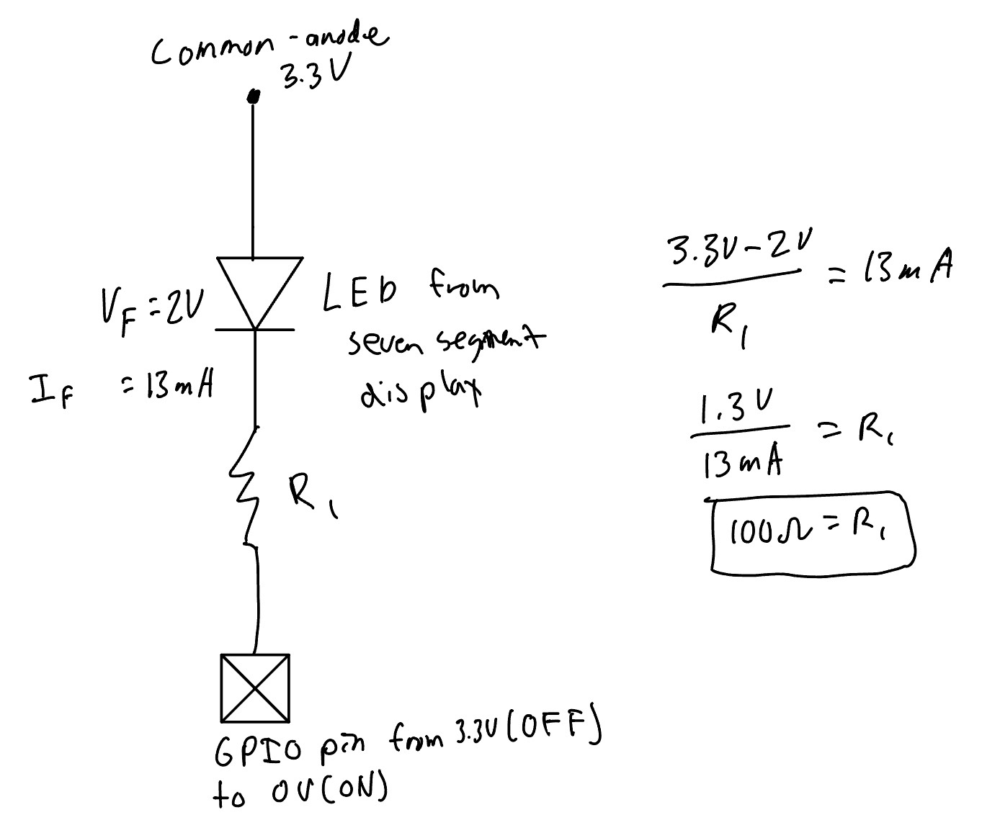

# Introduction
In this lab, I assembled and varified the hardware (custom PCB board, MCU and FPGA boards),designed and simulated FPGA logic,
programmed it onto the board, created testbenches to verify each individual module as well as the complete top-level design, 
programmed the design onto the FPGA, and experimentally confirmed that the LEDs and 7-segment display worked as specified.

# Design and Testing Methodology
The design was approached from both a hardware and a software perspective. From the hardware perspective, with implementation divided 
into smaller functional blocks that could be independently tested before being integrated into the top-level design

## Hardware Design

The hardware consists of the FPGA development board, four DIP switches, three LEDs and a common anode seven-segement display.
the four DIP switches provide the four-bit input to the FPGA, with adjacent switches corresponding to adjacent bits from `s[0]`
to `s[3]`. The switches are used to select the hexadecimal value displayed on the seven-segment display and to control the two
logic-operation LEDs.

The seven-segement display is connected using one FPGA output for each of the seven segements. Since the display is common-anode,
its common anode connection is tied to the 3.3V and the FPGA GPIO pins are connected to the individual sgement cathodes. A logic
low therefore causes the segment to illuminate. Each segment has its own current limiting resistor to keep the LED current within
the recommended operating range. Using individual resistors also helps ensure that the segments have consistent brightness regardless
of how many segements are illumninated 

<details>
<summary><b>Click to expand Calculations for Resistor Value</b></summary>

{#fig-led-calc fig-align="center"}

</details>

<details>
<summary><b>Click to expand Theory for Equal Illumination</b></summary>

{#fig-led-equal-illumination fig-align="center"}

</details>

Three LEDs are connected to the FPGA outputs that correspond to `led[0]` `led[1]` and `led[2]`. The first two LEDs implement the required
logic functions from the DIP switches, while the third LED is driven by the counter and flashes at 2.4Hz. The FPGA's
internal high speed oscillator (HSOSC) supplies the clock for the counter, so no external clock signal is required. 

<details>
<summary><b>Click to expand Calculation for Counter value for 2.4Hz blink rate</b></summary>

{#fig-counter-value-calc fig-align="center"}

</details>

## Verilog Design
The verilog design was divided into a seven-segment decoder and a counter, with the switch-to-LED logic implemented
directly in the top-level module. The seven-segment decoder uses a combinational case statement to map each of the sixteen 
possible four-bit inputs into a unique seven-segement pattern representative of the number/letter represented in hexadecimal.
The decoder provides distinct shapes for all hexadecimal values from 0x0 through 0xF.

The counter is implemnted in its own module using a single `always_ff` block. It includes reset, enable, and maximm count
functionality. When reset is asserted, the counter and blink output are cleared. When enable is asserted, the counter
increments on each rsing edge of the oscillator clck. When the counter reaches its maximum vaue, it returns to zero and toggles
blink output. The counter uses parameters for both its width and maximum count, allowing a small counter to be used during
simulation while the full-size cunter is used for the hardware implementation.

The switch-to-LED operations are implemented directly in the top-level-module using `assign` statements. This follows the
required structure while keeping the top-level design simple. the top-level module consits of the HSOSC and instantiations
of the counter and the seven-segement decoder

For the flashing LED, te counter was sized based on the oscillator frequency and required flashing frequency. With a 48MHz clock
and a desired LED frequency of 2.4Hz, the LED must complete one full on/off cycle at that frequency. Since the blink output
toggles twice during each cycle, it must toggle at a frequency two times 2.4Hz. Therefore, the counter requires

$$
\begin{aligned}
48\,\text{MHz} &= 48{,}000{,}000\,\text{Hz} \\
\text{counter value} &= \frac{48{,}000{,}000\,\text{Hz}}{2 \times 2.4\,\text{Hz}} \\
\text{counter value} &= 10{,}000{,}000
\end{aligned}
$$

clock cycles between toggles. The counter therefore counts from 0 through 9,999,999 before toggling the LED. A 24-bit counter
is sufficent becuase it can represent values up to 16,777,215.

## Testing 
Each functional portion of the design was tested independently using automatic SystemVerilog testbenches in QuestSim before
testing the complete top-level design.

The seven-segement decoder testbench tests all sixteen possible four-bit inputs. For each input, an assertion compared the decoder
output against the expected seven-segement pattern. This demonstrates that all hexadecimal digits from 0x0 through 0xF are
implemented correctly.

The counter testbench used a small parameterized maximum count so that its behavior could be observed quickly in simulation. 
The testbench verified each required counter feature. Reset was checked to ensure that the counter returned to zero, enable
was checked to ensure that the counter stopped when disabled and resumed when enabled, and the maximum count behavior was checked
to ensure that the counter returned to zero and toggled the blink output when the maximum value was reached. These tests
demonstrate the required sequential behavior without requiring millions of clock cycles to be simulated (much faster and
easier to confirm the counter is working).

The top-level testbench was designed to test functionality that was not already covered by the module-level testbenches. Becasue
top-level module generates its clock internally using HSOSC, the test bench does not provide an external clock. Instead,
the testbench observes the internal oscillator and verifies that it produces clock activity. The top-level testbench also
verifies that the seven-segement decoder is correctly connected to the top-level `seg` output, that the switch-to-LED `assign`
statements produce the correct outputs, and that the counter's blink output is correctly connected to `led[2]`.

# Technical Documentation
The source code for the project can be found in the associated [Github repository](https://github.com/joshuaikehara/e155-lab1/tree/274e9145daaaae359c8ea8ba6adafae6e45bb3e0/lab1_JI/source/impl_1)

## Block Diagram
{#fig-block-diagram fig-align="center"}

The block diagram in @fig-block-diagram demonstrates the overall architecture of the Verilog design. The top-level module lab1_JI includes three
submodules, the high-speed oscillator (HSOSC), the seven-segment display(lab1_seven_segment), and the counter (lab1_counter). The top-level
module also contains the XOR and AND gates used to control `led[0]` and `led[1]`,  respectively.

The internal oscillator generates the int_osc clock signal, which is connected to the `clk` input 
of the `blink_counter` instance. The counter generates the `blink` signal, which is connected to `led[2]`. The switch input `s[3:0]` is 
connected to the `seven_segment` instance and is also used as inputs to the XOR and AND gates. The ' seven_segment ' decoder produces
the `seg[6:0]` output. All module ports and internal nets are labeled, including the internal `inc_osc` and `blink` signals, and multi-bit
signals are represented using bus notation like `s[3:0]`.

## Schematic
{#fig-FPGA-hardware-interface fig-align="center"}

@fig-FPGA-hardware-interface shows the physical eletrical connections between the UPduino FPGA to the four DIP switches and
three LEDs connected through the custom PCB board. The schematic also shows the external connection to the common anode seven 
segment display. The DIP switches provide the four bit input to the FPGA, while the FPGA outputs drive the three LEDs and seven-segement 
display. Each LED and seven-segement segment is connected through its own current-limiting resistor to limit the ouotput 
current and prevent excessive loading of the FPGA I/O pins. The seven-segement display is common-anode, so its anode is connected
to 3.3V and the FPGA drives the individual cathoes low to illuminate the corresponding segements. The Schematic also labels 
the FPGA pin assignments and their corresponding variables in the SystemVerilog code, component values, and power and ground 
connections used to construct the circuit.


# Results and Discussions
The design accomplished all of the prescribed tasks for Lab 1. The four DIP switches correctly controlled the three LEDs
and the seven-segment display. The first LED follows the required XOR logic for switches S1 and S0, while the second LED turns on only
when both S3 and S2 are on. The seven-segment display correctly displays all sixteen hexadecimal values from 0 through F using the 
required common-anode, active-low outputs.

## Testbench simulation
The design was tested using QuestaSim with separate testbenches for the seven-segment decoder, counter, and top-level module. The
seven-segment testbench verified all sixteen possible switch combinations and confirmed that each hexadecimal value produced the 
expected segment pattern as shown in @fig-Seven-Segment-Decoder-tb-results.

{#fig-Seven-Segment-Decoder-tb-results fig-align="center"}

The counter testbench verified that reset set the counter to 0, `enable = 1` started the counter, `enable = 0` stopped the counter, 
and the counter wrapped back to 0 when it reached the maximum count. A reduced counter size was used to make the simulation faster.
The expected waveforms showing this working can be seen in @fig-counter-tb-results

{#fig-counter-tb-results fig-align="center"}

The top-level testbench verified the connections between modules, including the seven-segment decoder output and the segments of
the seven-segment display (`s[0]-s[6]`) and the counter output connected to `led [2]`. It also verified the combinational logic for 
`led [0]` and `led[1]` across all sixteen switch combinations since that wasn't tested in any other testbench. @fig-top-tb-results shows
the resulting QuestaSim waveforms, where the counter increments, wraps back to zero at the maximum count, and toggles the `blink` output.
`led [2]` follows the `blink` signal as expected.

For the physical design, the internal HSOSC was configured for its nominal 48 MHz output. To achieve the required 2.4 Hz blinking
frequency, `led [2]` must toggle at this rate, corresponding to 10,000,000 clock cycles. Therefore, the counter was configured with a maximum
count of 9,999,999. A 24-bit counter is sufficient because it can represent values up to 16,777,215.

This calculated frequency was futher conofimed experimentally by temporarily connecting `led[2]` to FPGA pin P44 and measuring the output
signal with an oscilloscope. The measured waveform had a frequency of 2.4 Hz, as shown in @fig-oscilloscope-results.

<details>
<summary><b>Click to Expand to see Oscilloscope Measurement of LED 2 Blinking Frequency</b></summary>

{#fig-oscilloscope-results fig-align="center"}

</details>

Overall, the simulation and hardware testing demonstrated that the design met the functional requirements of the lab. The use of parameterized
counter width and maximum count also allows the counter to be easily modified for faster simulation or different output frequencies without
changing the underlying counter logic.


{#fig-top-tb-results fig-align="center"}

# Conclusion
The design successfully implemented all required functionality, including the four-bit DIP switch inputs, hexadecimal display
on the common-anode seven-segement display, the two switch-controlled LEDs, and the blinking LED driven by the FPGA's on-board
high speed oscillator. The design was tested using automatic SystemVerilog testbenches and QuestaSim waveforms, and the hardware
was used to verify the required display and LED behavior. **I spent 20 hours working on this lab**.

# AI Prototype Summary

<details>
<summary><b>Click to Expand to see the AI generated code for the 2 Hz blink</b></summary>
```{.systemverilog}
module top (
    output logic led
);

    // Internal clock signal
    logic clk;

    // Instantiate the iCE40 UltraPlus High-Frequency Oscillator
    // CLKHF_DIV: "0b00" = 48 MHz, "0b01" = 24 MHz, "0b10" = 12 MHz, "0b11" = 6 MHz
    HSOSC #(
        .CLKHF_DIV("0b00") 
    ) hfosc_inst (
        .CLKHFEN (1'b1), // Enable clock output
        .CLKHFPU (1'b1), // Power up the oscillator
        .CLKHF   (clk)   // Connect to our internal logic clock
    );

    // Math for a 2 Hz blink rate (0.5 second period):
    // To achieve a 2 Hz blink, the LED must toggle every 0.25 seconds.
    // 48,000,000 cycles/sec * 0.25 sec = 12,000,000 cycles.
    localparam int TOGGLE_COUNT = 12_000_000;
    
    // 24-bit counter is enough to hold 12,000,000
    logic [23:0] counter = '0; 
    logic        led_reg = '0;

    // Sequential logic for the counter and LED toggle
    always_ff @(posedge clk) begin
        if (counter == TOGGLE_COUNT - 1) begin
            counter <= '0;
            led_reg <= ~led_reg;
        end else begin
            counter <= counter + 1'b1;
        end
    end

    // Drive the output port
    assign led = led_reg;

endmodule
```
</details>

I think that the LLM's output quality is pretty good, especially because we just made something very similar and 
also made a counter in E85. Thus, there wasn't really any syntax that it used that was unknown, but I did like how it
had good comments telling me what each part of the code did. The LLM also briefly explained some of the math behind how the counter worked
and was even able to explain the different clock divisions available for the internal oscillator, which I thought was a good addition. 
The code worked on the first attempt and synthesized successfully without any issues. 

I think the main reason I was able to evaluate the quality of the LLM's output is that I already understood what the solution
should look like. I knew how counters work, what the different SystemVerilog functions were doing, like `always_ff`, and how those 
parts should transform into a LED blinking at the desired frequency. If I didn't already have that background knowledge, 
I would have a much harder time determining whether the LLM's solution was actually correct or just looked reasonable. This 
made me realize that there can be a significant difference between being able to generate code with an LLM and actually understanding
and evaluating the code that it produces

The next time that I use an LLM, I think it would be useful for generating basic submodules such as a counter, an adder, or another component 
that we have had extensive practice designing ourselves. These are situations where I can independently determine whether
the generated code is working correctly. I also think an LLM could be especially useful in understanding and interpreting 
error messages or issues that are poorly documented or difficult to interpret. An LLM could help explain what an error means
and suggest possible changes which I could then evaluate based on my understanding of the system and determine whether the change
would actually fix the problem or potentially introduce another issue.

The biggest benefit that I can see is the potential time saving. Even though I know how to make something like an LED blinker myself,
the LLM was able to produce a working solution in only a few seconds. However, I think it is important to use that speed 
without becoming dependent on it. Overall, I think LLMs can be a very useful tool for engineering design and programming, but the tool is only
as good as its user, so it's important to be using it alongside an understanding of the underlying concepts to independently evaluate the output.