# Introduction
In this lab, a multiplexed two-digit seven-segment display and a four-row keypad scanning circuit
were implemented on the FPGA. The design builds on the counter and seven_segment_decoder modules 
developed in Lab 1 and demonstrates how existing modules can be reused to construct a larger system.
A single seven-segment decoder was time multiplexed between two hexadecimal inputs, while a separate
counter-based scanning circuit sequentially activated the four keypad rows. The keypad column inputs
were also inverted(since a column output was low-active while the LED output was high-active) and
displayed on LEDs to provide a visual indication of the signals detected by the FPGA.

The design uses the FPGA's high-speed oscillator (HSOSC) as the system clock. Parameterized instances of
Lab 1 counter were used for both the display multiplexing and keypad scanning circuits. The design was
simulated in QuestaSim using automatic testbenches for both the scanning module and time multiplex display
and their corresponding top-level module before being tested on the physical FPGA hardware.

# Design and Testing Methodology
The lab was approached as two separate hardware builds. The first build focused on multiplexing the 
seven-segment displays, while the second focused on scanning the keypad and displaying its column signals 
on LEDs. For both builds, the FPGA's high-speed oscillator (HSOSC) was used as the clock source, and 
the counter from Lab 1 was reused rather than implementing counters directly inside the new modules.

## Build 1: Multiplexed Seven-Segment display

The first build implemented a two-digit hexadecimal display using only a single instance of `lab1_seven_segment` 
decoder. A parameterized counter was used to periodically switch between the two hexadecimal inputs. The
resulting `digit_select` signal controls which display is active and determines which hexadecimal value is
passed to the decoder. The display is therefore time multiplexed. Only one digit is driven at a time, but the
switching occurs rapidly enough that both digits appear continuously illuminated to the observer. The counter
parameters were selected to produce the required multiplexing frequency on the physical FPGA.

<details>
<summary><b>Click to expand Calculations for the sufficently quick multiplexing frequency</b></summary>
Since the FPGA clck operates at a frequency of $48~\text{MHz}$, the corresponding clock period is:
$$
T_{clk} = \frac{1}{f_{clk}}
= \frac{1}{48\times10^6}
\approx 20.83~\text{ns}.
$$
The seven-segment display was multiplexed at a frequency of $1~\text{kHz}$. Therefore, the multiplexing period is

$$
T_{mux} = \frac{1}{f_{mux}}
= \frac{1}{1000}
= 1~\text{ms}.
$$

The number of FPGA clock cycles required for one complete multiplexing period is

$$
N_{mux} = \frac{f_{clk}}{f_{mux}}
= \frac{48\times10^6}{1000}
= 48{,}000~\text{cycles}.
$$
Since the two displays are alternated during each multiplexing period, each display is active for half of the period:

$$
T_{digit} = \frac{T_{mux}}{2}
= \frac{1~\text{ms}}{2}
= 0.5~\text{ms}.


This corresponds to half of the multiplexing counter's total count:

$$
N_{half} = \frac{N_{mux}}{2}
= \frac{48{,}000~\text{cycles}}{2}
= 24{,}000~\text{cycles}.
$$ {#eq-tclk}

Thus, each display has a $50\%$ duty cycle and is refreshed at $1~\text{kHz}$. Which should be 
faster than the human eye can see and still have enough time for the physical system to change 
without bleeding or flickering to meet the specs.

</details>

For simulation, the counter parameters were reduced so that the display could switch between two digits within a short
simulation. The testbench verified that each hexadecimal input was sent to the decoder when its corresponding
display was selected and that reset returned the multiplexing circuit to its initial state.

The seven-segment display was driven using PNP transistors as a source switch. Each FPGA control output was connected through a
$1~\text{k}\Omega$ resistor to the base of a PNP transistor. The emitter of the transistor was connected to the $3.3~\text{V}$ supply, 
while the collector supplied the common-anode connection of the display. The individual LED segments were then connected through a 
current-limiting resistor back to an FPGA GPIO output.

The $1~\text{k}\Omega$ base resistor was selected to provide sufficient base current to drive the PNP transistor into saturation 
while limiting the current drawn from the FPGA GPIO.

<details>
<summary><b>Click to expand Calculations for the current limiting resistors for both the Base and LED display</b></summary>
The base current was calculated from the voltage across the base-emitter junction:

$$
I_B =
\frac{V_{CC}-V_{OL(max)}-V_{BE(sat)}}{R_B}=\frac{3.3V-0.4V-0.75V}{2.15 mA}=1k\Omega
$$ {#eq-rpnp}

where $V_{CC}=3.3~\text{V}$, $R_B=1~\text{k}\Omega$, $V_{OL(max)}=0.4V$, and $V_{BE(sat)}=0.75V$ was taken from the GPIO datasheet 
@fig-GPIO-datasheet and transistor datasheet @fig-pnp-transistor-graph The calculated base respectively. The FPGA's $V_{OL,\max}$ 
value was used rather than $V_{OL,\min}$. Since the PNP transistor turns on when the FPGA output pulls the base low, the highest 
possible low-level output voltage produces the smallest voltage across the base resistor and therefore the smallest base current. 
Using $V_{OL,\max}$ provides a worst-case check that there is still sufficient base current to saturate the transistor under 
all guaranteed FPGA output conditions.

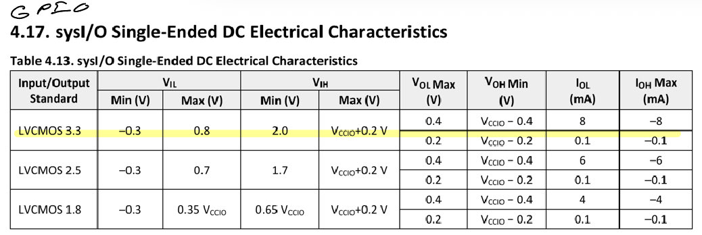{#fig-GPIO-datasheet fig-align="center"}


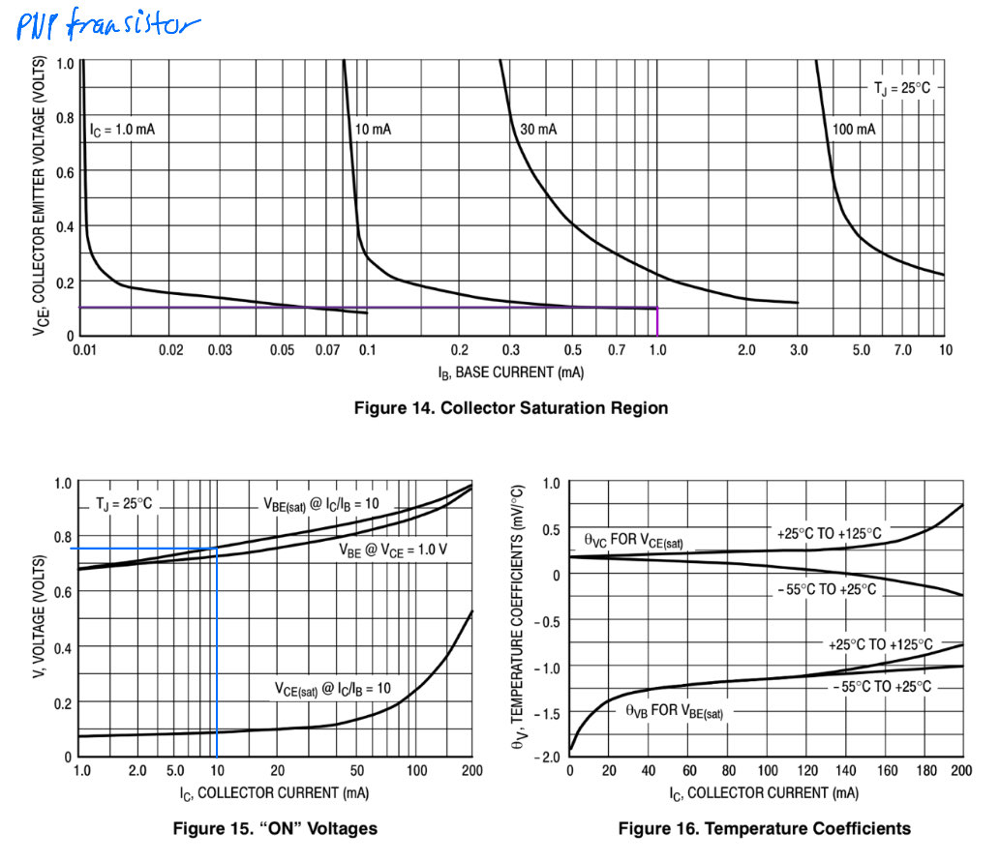{#fig-pnp-transistor-graph fig-align="center"}

Current was then compared with the required collector current to verify that the transistor would remain saturated.
A target collector current of approximately $14~\text{mA}$ was selected for the LED segments to provide sufficient brightness while 
remaining within the display's recommended operating range. The required LED current-limiting resistor was calculated using the 
transistor saturation voltage and the LED forward voltage:

$$
R_{LED} =
\frac{V_{CC}-V_{CE(sat)}-V_F}{I_C}.
=\frac {3.3V-0.1V-1.8V}{14 mA}=100 \Omega
$$ {#eq-rled}

The LED forward voltage, $V_F$, was obtained from the seven-segment display datasheet using the forward-current versus forward-voltage 
characteristic graph seen in @fig-led-datasheet at approximately $14~\text{mA}$. Using the resulting forward voltage and the target 
collector current gave a required resistance of approximately $100~\Omega$. The selected $100~\Omega$ resistor therefore limits the LED current 
to approximately the desired operating current.

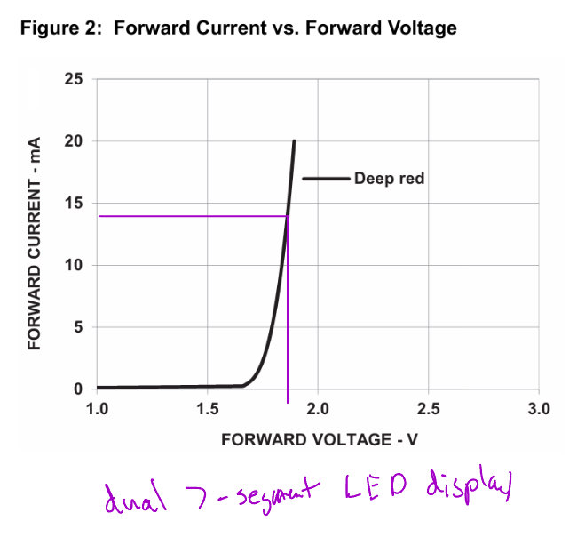{#fig-led-datasheet fig-align="center"}


Finally, the PNP transistor was checked for saturation using a conservative forced current gain of 10. The resulting ratio was calculated as

$$
\frac{I_C}{I_B}<10 \rightarrow \frac{14 mA}{2.15 mA}=6.51 mA < 10 mA
$$

Since the calculated collector-to-base current ratio was below 10, the available base current was sufficient to drive the transistor 
into saturation at the desired LED current. This ensured that the transistor operated as an effective high-side switch while keeping
the FPGA output current within its required limits.
</details>

## Build 2: Keypad scanning
The second build implemented the keypad scanning circuit separately from the seven-segment display. A parameterized instance of Lab 1's
counter generates the scanning timing

<details>
<summary><b>Click to expand Calculations for the Rate of Toggling the Active row </b></summary>
if the rows are: 

$$
1000 \rightarrow 0100 \rightarrow 0010 \rightarrow 0001 \rightarrow 1000
$$

The keypad scanning circuit cycles through the four row outputs at a rate of $2~\text{Hz}$. Therefore, the full scanning period is

$$
T_{\text{scan}}=\frac{1}{2~\text{Hz}}=0.5~\text{s}.
$$

With a $48~\text{MHz}$ FPGA clock, this requires

$$
N_{\text{scan}}=(48\times10^6)(0.5)
=24{,}000{,}000~\text{cycles}.
$$

Since the four rows are active sequentially, each row is active for

$$
N_{\text{row}}=\frac{24{,}000{,}000}{4}
=6{,}000{,}000~\text{cycles}.
$$

The counter was therefore parameterized with a maximum count of $23{,}999{,}999$, with row transitions
occurring at $5{,}999{,}999$, $11{,}999{,}999$, and $17{,}999{,}999$ cycles.


</details>

Assignment statements convert the counter output into four one-hot keypad row signals
$$
1000 \rightarrow 0100 \rightarrow 0010 \rightarrow 0001 \rightarrow 1000
$$
Each row is activated sequentially as the counter progresses through its predefined ranges. The scanning module also 
supports both reset and enable functionality. The four column inputs are connected to the LEDs through an inverter,
since the columns are LOW-Active and the LEDs are high-active, thus allowing the column activity to be directly observed 
in the LEDs.

The keypad rows were implemented using $2N3904$ NPN transistors as open-collector outputs. When a row is selected every 2 Hz, the 
FPGA GPIO drives the transistor's base HIGH, causing the transistor to pull the keypad row to ground and holding the column 
LOW. A $10~\text{k}\Omega$ pull-up resistor on each column holds the column HIGH when no key is pressed.

The base resistor was selected to limit the current supplied by the FPGA GPIO. Using the minimum guaranteed FPGA HIGH 
output voltage gives the worst-case base current to ensure that it is saturated at all times.

<details>
<summary><b>Click to expand Calculations for current limiting resistors </b></summary>

To find the base current coming from the GPIO to the NPN transistor, we can use the following equation:
$$
I_B=\frac{V_{OH,\min}-V_{BE(sat)}}{R_B}
\approx 2.25~\text{mA}.
$$

Where $V_{OH,\min}=3.3V-0.4V$ as seen in @fig-GPIO-datasheet and that is about $V_{BE(sat)}=0.65$ for a $I_c=0.31mA$ as seen in @fig-npn-datasheet.
We also see that the maximum current being drawn at the output is $2.25 mA$ which is well within the 8 mA max, as seen in @fig-GPIO-datasheet.
The maximum collector current is limited by the $10~\text{k}\Omega$ column pull-up resistor:

$$
I_C=\frac{V_{CC}-V_{CE(sat)}}{10~\text{k}\Omega}
\approx 0.32~\text{mA}.
$$ {#eq-rnpn}

Where $V_{CC}=3.3 V$,$V_{CE(sat)}=0.1 V$ as seen in. The transistor was checked for saturation
using a conservative forced current gain of 10:

$$
\frac{I_C}{I_B}
=\frac{0.32~\text{mA}}{2.25~\text{mA}}
\approx0.142<10.
$$

Thus, the available base current is more than sufficient to saturate the transistor. 
With the transistor saturated, the row voltage is approximately $V_{CE(sat)}=0.1~\text{V}$ as seen in @fig-npn-datasheet. 
This is below the FPGA's maximum guaranteed LOW input voltage, $V_{IL,\max}=0.8~\text{V}$ as seen in @fig-GPIO-datasheet, 
so the FPGA reliably recognizes the pressed-key state as LOW.

When no key is pressed, the $10~\text{k}\Omega$ pull-up resistor brings the column to 
approximately $3.3~\text{V}$. This is above the FPGA's minimum guaranteed HIGH input voltage, 
$V_{IH,\min}=2.0V$, ensuring that the column is reliably read as HIGH when inactive. The pull-up 
resistor also limits the current when the NPN transistor pulls the column LOW, making the 
open-collector configuration tolerant of multiple simultaneous key presses.

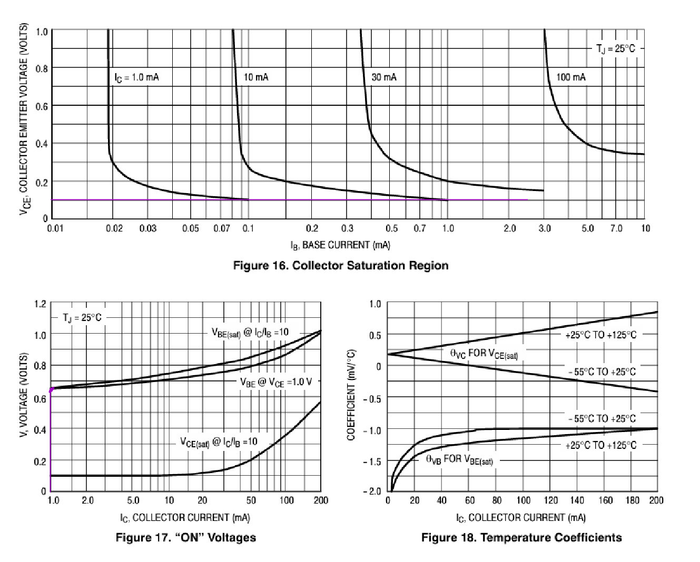{#fig-npn-datasheet fig-align="center"}

</details>

A similar calculation was performed for the single LED indicator that wasn't already on the board. The LED was connected to the 
$3.3~\text{V}$ supply through a $10~\text{k}\Omega$ resistor, with a $2N3904$ NPN transistor used as a way to connect it to ground. 
The transistor base was controlled by an FPGA GPIO through a $1~\text{k}\Omega$ resistor. The base current was calculated using the 
minimum guaranteed GPIO HIGH voltage and $V_{BE(sat)}$ to verify sufficient drive current. 
The collector current was then determined from the $10~\text{k}\Omega$ LED resistor and the LED forward voltage. 
Finally, the ratio $I_C/I_B$ was checked to ensure it remained below the forced gain of 10, confirming that the transistor would 
operate in saturation while limiting the LED current.

<details>
<summary><b>Click to expand Calculations for current limiting resistors for the one LED</b></summary>

To find the base current coming from the GPIO to the NPN transistor, we can use the following equation:
$$
I_B=\frac{V_{OH,\min}-V_{BE(sat)}}{R_B}
\approx 2.25~\text{mA}.
$$

Where $V_{OH,\min}=3.3V-0.4V$ as seen in @fig-GPIO-datasheet and that is about $V_{BE(sat)}=0.75$ for a $I_c=10mA$ as seen in @fig-npn-datasheet.
We also see that the maximum current being drawn at the output is $2.25 mA$, which is well within the $8 mA$ max as seen in @fig-GPIO-datasheet.
Now, we want to find the current of the collector to ensure that the transistor is still saturated.

$$
I_C=\frac{V_{CC}-V_{CE(sat)}-V_{F(LED)}}{120\Omega}
\approx 10~\text{mA}.
$$

Where $V_{CC}=3.3 V$,$V_{CE(sat)}=0.1 V$, and $V_{F(LED)}=2.06$ as seen in @led-2. The transistor was checked for saturation
using a conservative forced current gain of 10:

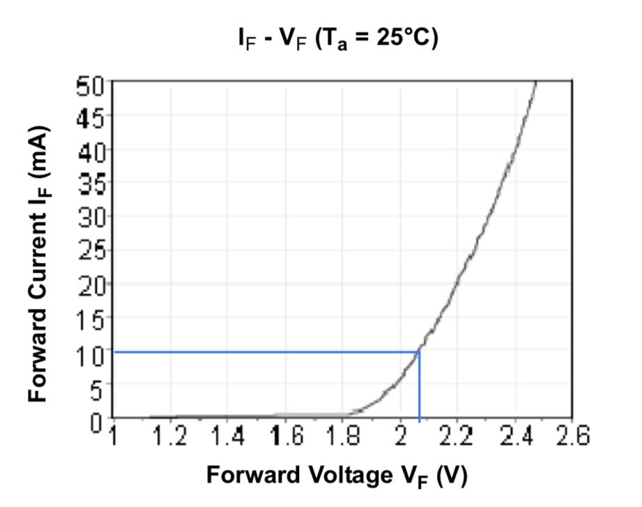{#led-2 fig-align="center"}


$$
\frac{I_C}{I_B}
=\frac{0.32~\text{mA}}{2.25~\text{mA}}
\approx0.142<10.
$$

Thus, the available base current is more than sufficient to saturate the transistor. 
With the transistor saturated, the row voltage is approximately $V_{CE(sat)}=0.1~\text{V}$ as seen in @fig-npn-datasheet. 
This is below the FPGA's maximum guaranteed LOW input voltage, $V_{IL,\max}=0.8~\text{V}$ as seen in @fig-GPIO-datasheet, 
so the FPGA reliably recognizes the pressed-key state as LOW.

When no key is pressed, the $10~\text{k}\Omega$ pull-up resistor brings the column to 
approximately $3.3~\text{V}$. This is above the FPGA's minimum guaranteed HIGH input voltage, 
$V_{IH,\min}=2.0V$, ensuring that the column is reliably read as HIGH when inactive. The pull-up 
resistor also limits the current when the NPN transistor pulls the column LOW, making the 
open-collector configuration tolerant of multiple simultaneous key presses.

{#fig-npn-datasheet fig-align="center"}

</details>

For simulation, the scanning counter parameters were also reduced so that each row remained active for only a few clock cycles. 
This allowed the complete scanning sequence to be tested quickly while the physical hardware retained the parameters required 
for the intended scanning rate.
## Simulation Testing

Separate automatic testbenches were used to verify the two builds. The scanning testbench demonstrated all four row outputs, 
transitions between rows, counter wraparound, reset, and enable behavior. The top-level keypad testbench additionally 
verified that the column inputs were correctly represented on the LEDs.

The seven-segment build was tested separately to verify the multiplexing behavior and correct display of the two hexadecimal 
inputs. No separate simulations of the Lab 1 counter or seven-segment decoder were performed because those modules had 
already been verified in the previous lab. 

# Technical Documentation

The source code for both Lab 2 builds can be found in the associated GitHub repository

[Build 1: Dual 7 segment display](https://github.com/joshuaikehara/e155-lab1/tree/main/lab2_JI/source/impl_1)

[Build 2: Keypad scanner](https://github.com/joshuaikehara/e155-lab1/tree/main/lab2_part2_JI/source/impl_1)

## Build 1: Seven-Segment Display Block Diagram

The first build uses the HSOSC as the clock source, which drives the parameterized multiplexing counter. The counter 
generates the `digit_select` signal used to select between the two hexadecimal inputs. The selected value is then 
passed to the single `lab1_seven_segment` decoder, whose output drives the segment lines. Assignment statements 
control which of the two display anodes are activated.

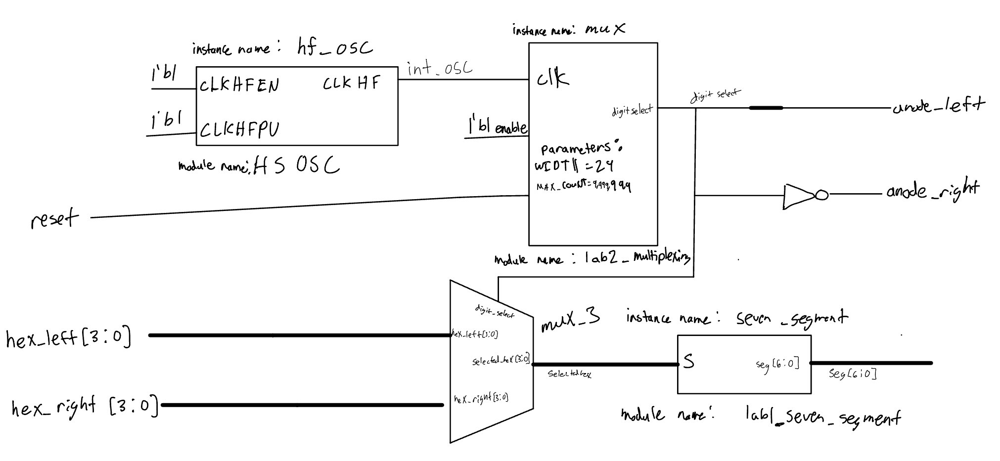{#fig-schematic-dual fig-align="center"}


## Build 2: Keypad Scanner Block Diagram
The second build uses the HSOSC to drive the parameterized scanning counter. The counter output is converted into 
the four keypad row signals using assignment statements. The keypad column inputs (LOW active) are inverted and connected to 
the LEDs (HIGH active) so that column activity can be observed during operation.

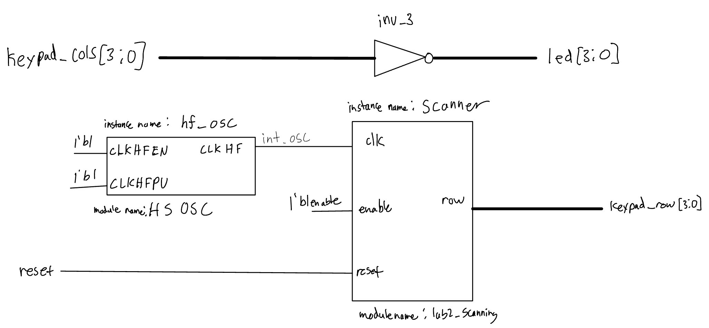{#fig-schematic-dual fig-align="center"}

## Build 1: Seven-Segment Display Schematics

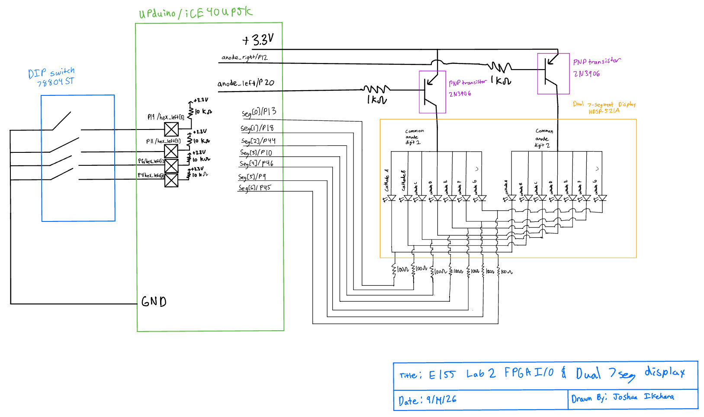{#fig-schematic-dual fig-align="center"}

The @fig-schematic-dual schematic shows the FPGA connections to the two seven-segment displays and the associated current-limiting resistors. 
Component values, part numbers, FPGA pin numbers, and signal names are labeled according to the schematic requirements.

## Build 2: Keypad Scanner Display Schematics
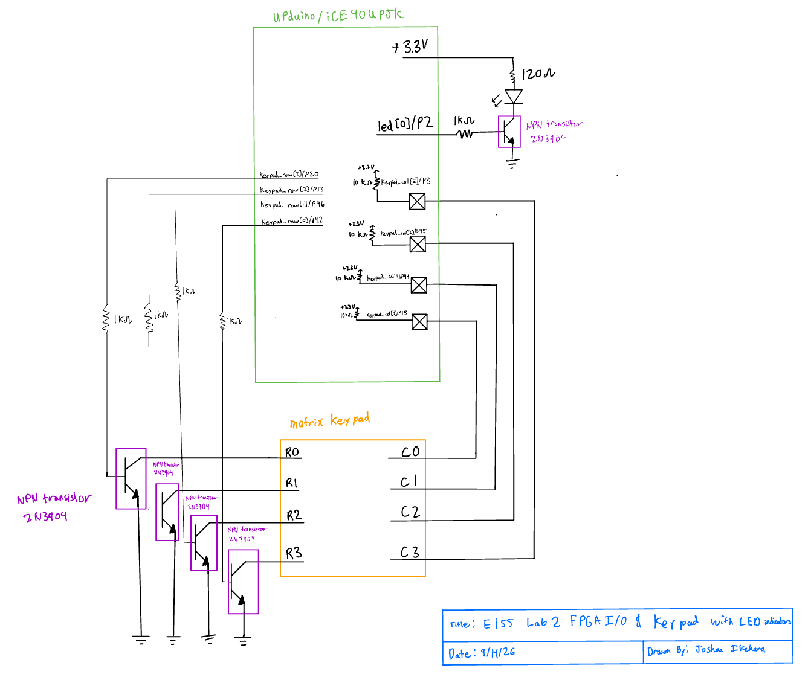{#fig-schematic-keypad fig-align="center"}

The @fig-schematic-keypad schematic shows the FPGA connections to the four keypad rows, four keypad columns, and LEDs. Series resistors 
were used where required to limit FPGA output current.

# Results and Discussion

## Build 1: Seven-Segment Display

The seven-segment multiplexing design met the intended functional requirements. The `lab2_multiplexing_tb` testbench verified that the 
`digit select` signal correctly switches between the two displays, that the counter wraps around as expected, and that reset returns the 
multiplexing circuit to the correct initial state. The `lab2_top_tb` testbench further verified the complete top-level functionality, 
including the correct anode selection and seven-segment patterns for the hexadecimal values displayed on each digit. The testbench 
confirmed that the displayed values can be changed and that the circuit correctly responds to reset.
 
## Testbench Simulation

The multiplexing counter was parameterized with smaller values for simulation so that the display transitions could be observed 
without waiting for the full hardware counter period. The module-level testbench used a counter range of 0-7, with the display 
selection changing at a count of 4. The top-level testbench used the same reduced parameters while retaining the normal 
HSOSC clock source. The simulations demonstrated the expected alternating selection of the left and right displays 
and the corresponding segment patterns.

The testbenches successfully verified the major functional behaviors of the seven-segment design, including multiplexing, 
counter wraparound, reset behavior, and hexadecimal display decoding. No functional issues were identified during 
simulation.

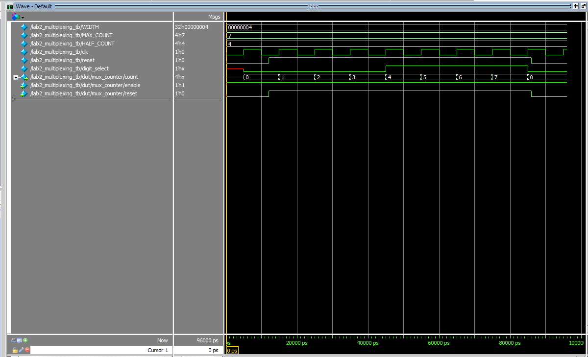{#fig-multiplexing-tb fig-align="center"}

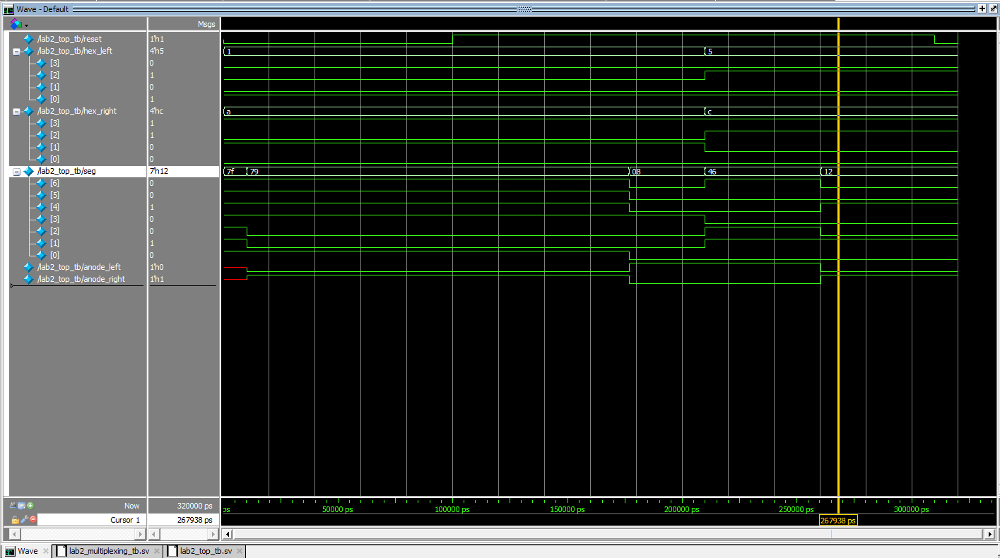{#fig-top-p1-tb fig-align="center"}

## Build 2: Keypad Scanner
The keypad scanning design met the intended functional requirements. The `lab2_scanning_tb` testbench verified that the scanning 
circuit sequentially activates each row in the expected `1000`, `0100`, `0010`, and `0001` pattern. It also verified counter 
wraparound, reset behavior, and the enable input. When enable was deasserted, the active row remained unchanged, and scanning 
resumed correctly when enable was asserted again.

The `lab2_top_tb` testbench verified the complete keypad interface, including the row scanning outputs and LED passthrough 
from the keypad columns. Multiple column input patterns were tested to confirm that the LED outputs were the inverse of the 
column inputs. The top-level reset behavior and complete four-row scanning sequence were also verified.

## Testbench Simulation
Both testbenches used reduced counter parameters to allow the scanning sequence to be observed quickly in QuestaSim. 
The scanning module testbench demonstrated all four row transitions, counter wraparound, enable behavior, and reset. 
The top-level testbench additionally verified the LED output for several column input combinations while the keypad 
scanning circuit was operating.

The simulations demonstrated that the keypad scanning and LED passthrough logic operated as intended. All tested row 
transitions and output conditions produced the expected results, and no functional issue were identified during simulation.

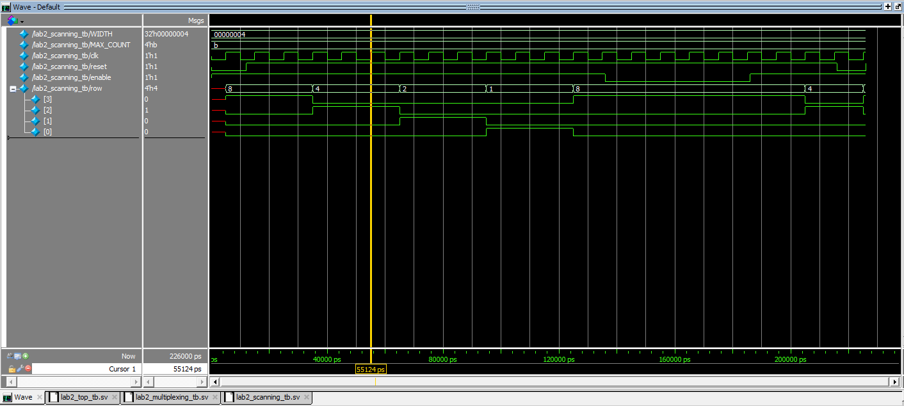{#fig-scanning-tb fig-align="center"}

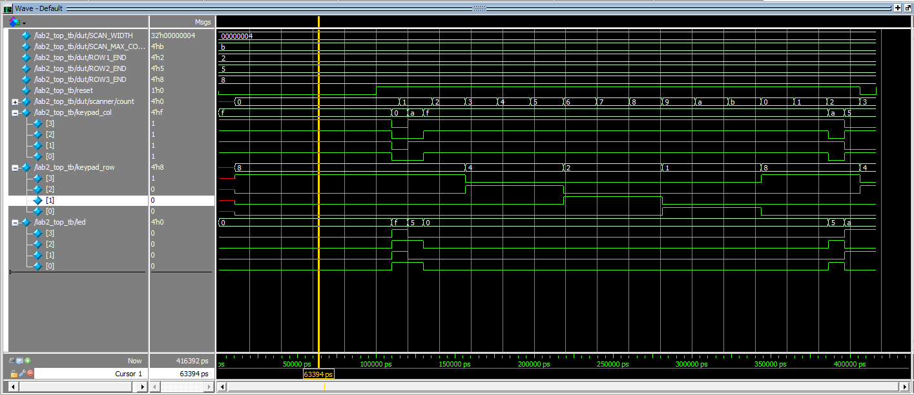{#fig-top-p2-tb fig-align="center"}

# Conclusion
Two separate FPGA builds were successfully developed for Lab 2. The first build implemented a time-multiplexed two-digit seven-segment 
display using a single reused seven-segment decoder and a parameterized counter. The second build implemented a four-row keypad scanner 
using another parameterized counter, with the keypad column signals displayed on LEDs.

Both designs reused the verified Lab 1 counter rather than implementing counters inline. Automatic QuestaSim testbenches were used to 
verify the required functionality, including multiplexing, keypad row transitions, reset, enable, wraparound, and LED driving.

The designs met the Lab 2 requirements. There does seem to be a slight issue when multiple buttons are pushed in the same row and then 
a button is pushed in the row below it in the same column as one of them, that makes them all blink as if they were pushed down in both rows.

I spent approximately 18 hours on this lab.

# AI Prototype Summary

<details>
<summary><b>Click to expand to see the AI-generated code for the 2 Hz blink</b></summary>
```{.systemverilog}
module time_mux_7seg (
    input  logic       clk,
    input  logic       rst_n,
    input  logic [3:0] in0,      // First 4-bit binary input
    input  logic [3:0] in1,      // Second 4-bit binary input
    output logic [6:0] seg0,     // First 7-segment display output [g,f,e,d,c,b,a]
    output logic [6:0] seg1      // Second 7-segment display output [g,f,e,d,c,b,a]
);

    logic       sel;
    logic [3:0] mux_in;
    logic [6:0] decoded_seg;

    // Toggle select signal every clock cycle to alternate inputs
    always_ff @(posedge clk or negedge rst_n) begin
        if (!rst_n)
            sel <= 1'b0;
        else
            sel <= ~sel;
    end

    // Input Multiplexer: selects between in0 and in1
    always_comb begin
        mux_in = sel ? in1 : in0;
    end

    // Shared 4-to-7 Common Anode Decoder (0 = Segment ON, 1 = Segment OFF)
    // Bus mapping: {g, f, e, d, c, b, a}
    always_comb begin
        case (mux_in)
            4'h0: decoded_seg = 7'b100_0000;
            4'h1: decoded_seg = 7'b111_1001;
            4'h2: decoded_seg = 7'b010_0100;
            4'h3: decoded_seg = 7'b011_0000;
            4'h4: decoded_seg = 7'b001_1001;
            4'h5: decoded_seg = 7'b001_0010;
            4'h6: decoded_seg = 7'b000_0010;
            4'h7: decoded_seg = 7'b111_1000;
            4'h8: decoded_seg = 7'b000_0000;
            4'h9: decoded_seg = 7'b001_0000;
            4'hA: decoded_seg = 7'b000_1000;
            4'hB: decoded_seg = 7'b000_0011;
            4'hC: decoded_seg = 7'b100_0110;
            4'hD: decoded_seg = 7'b010_0001;
            4'hE: decoded_seg = 7'b000_0110;
            4'hF: decoded_seg = 7'b000_1110;
            default: decoded_seg = 7'b111_1111; // All OFF
        endcase
    end

    // Output Demultiplexer / Registers: latches decoded value to corresponding output bus
    always_ff @(posedge clk or negedge rst_n) begin
        if (!rst_n) begin
            seg0 <= 7'b111_1111;
            seg1 <= 7'b111_1111;
        end else begin
            if (sel == 1'b0)
                seg0 <= decoded_seg;
            else
                seg1 <= decoded_seg;
        end
    end

endmodule
```
The result after putting in my code and prompting it with the second question 

```{.systemverilog}
module dual_seg_time_mux (
    input  logic       reset,
    input  logic [3:0] hex_left,
    input  logic [3:0] hex_right,
    output logic [6:0] seg_left,
    output logic [6:0] seg_right
);

    logic int_osc;
    logic digit_select;
    logic [3:0] selected_hex;
    logic [6:0] decoded_seg;

    // Internal high-speed oscillator instance
    HSOSC #(
        .CLKHF_DIV(2'b00)
    ) hf_osc (
        .CLKHFPU(1'b1),
        .CLKHFEN(1'b1),
        .CLKHF(int_osc)
    );

    // Multiplexing counter controller[cite: 2]
    lab2_multiplexing mux_ctrl (
        .clk(int_osc),
        .reset(reset),
        .digit_select(digit_select)
    );

    // Input MUX: alternates between hex_left and hex_right[cite: 1]
    assign selected_hex = digit_select ? hex_right : hex_left;

    // Single common-anode seven-segment decoder instance[cite: 1, 3]
    lab1_seven_segment decoder (
        .s(selected_hex),
        .seg(decoded_seg)
    );

    // Demultiplexer registers: latches decoded value to corresponding 7-bit output bus
    always_ff @(posedge int_osc) begin
        if (~reset) begin
            seg_left  <= 7'b111_1111; // Active-low off state[cite: 3]
            seg_right <= 7'b111_1111; // Active-low off state[cite: 3]
        end else if (digit_select) begin
            seg_right <= decoded_seg;
        end else begin
            seg_left  <= decoded_seg;
        end
    end

endmodule
```
</details>

For this prototype, I used an LLM to generate SystemVerilog for a time-multiplexed two-digit 
seven-segment display. I first gave the LLM the prompt without any additional context. The 
resulting code was functional in concept, but it implemented the seven-segment decoder and 
multiplexing logic entirely within a single module. I think that the general idea to solve
the problem was essentially the same. The only thing was it wasn't created in a modular way, which would prevent the use of these modules in future applications, which is a limitation. 
However, I think it worked basically identical to my implementation. It did, however, make it
so that the output would toggle between each anode every clock cycle, which would be way too
quick and cause bleeding.

I then repeated the experiment using my Lab 1 files as context. The difference was significant
because the LLM was able to use the existing `lab1_seven_segment` decoder, `lab2_multiplexing` 
module, and `HSOSC` oscillator rather than recreating these components. The generated code 
created these existing modules and connected them together using an input multiplexer. 
This made the second design more consistent with the structure of my Lab 2 project 
and reduced the amount of new logic that needed to be written.

The context-aware response was more useful because it reused my existing modules and oscillator, 
while the context-free response created its own clock and decoder logic. However, the context-aware 
response still added unnecessary sequential registers (don't need a right and left seg, just need a seg 
as the multiplexer takes care of which one to choose), so reviewing and modifying the generated code 
would still need to be done. This showed me that providing context improves LLM-generated Verilog, 
but the code still needs to be checked for correctness and efficiency.