# Introduction

In this lab, a keypad scanner was implemented on an FPGA to read a 4 × 4 matrix keypad 
and display the most recently pressed hexadecimal digits on a dual seven-segment display. 
The design builds on the keypad interface, seven-segment decoder, multiplexing logic, 
and counter modules developed in Lab 1 and Lab 2.

The primary design challenge was ensuring that each physical key press was registered 
exactly once while handling switch bounce, asynchronous keypad inputs, and cases where 
multiple keys were pressed simultaneously. The final design uses synchronized keypad 
inputs and a finite state machine (FSM) to control the output from keypad scanning
and keypress detection showing up on the dual seven segment display.

The design was also tested in simulation with a testbench designed to exercise the 
important state transitions and keypad input conditions before being deployed to 
the FPGA.

# Design and Testing Methodology

The design was divided into several modules so that each module has a clearly defined
responsibility. The major components are: 

- **Keypad scanner**: Drives the four keypad rows and determines which column is active
- **input synchronizer**: synchronizes the asynchronous keypad column inputs to the FPGA
clock
- **Key detection and debouncing FSM**: Determines when a valid key press has occurred 
and prevents a held or bouncing key from generating multiple entries.
- **Key decoder**: Converts the detected row and column into a hexadecimal value.
- **Display register**: Stores the two most recently accepted hexadecimal digits.
- **Seven-segment decoder**: Converts hexadecimal digits into seven-segment display patterns.
- **Display multiplexer**: Rapidly alternates between the two seven-segment displays so 
that both appear continuously illuminated.
- **Counters**: Provide the timing enables required for keypad scanning and display multiplexing.

The design was implemented synchronously using the FPGA system clock. Rather than creating additional
asynchronous clocks, slower operations are controlled using clock-enable signals generate by the counters

## Keypad scanning

The keypad consists of four rows and four columns. The scanner sequentially drives one row active at 
a time and reads the corresponding column inputs. The row and column combination identifies 
which key is being pressed.

Because the keypad inputs are asynchronous to the FPGA clock, the column signals are first passed 
through synchronizer registers. This prevents metastability from propagating into the rest of the design.

The scanner cycles continuously through the four rows. When a valid column assertion is detected, 
the current row and column identify the pressed key.

## Keypress Detection and debouncing

A key press cannot simply be interpreted as "a column is active" because a mechanical switch 
may bounce between its open and closed states for several milliseconds. Additionally, holding 
a key down must not generate repeated keypresses.

The design therefore seperates the detectin of a key from the recording of a key press. Once a valid
single-key condition is detected, the corresponding hexadecimal value is recorded once. The FSM then
waits for the key to be released before accepting another key press. 

The design also handles multiple simultaneous key presses. If more than one key is detected, the condition
is treated as invalid rather than arbitrarily selecting one of the keys. This prevents an intermediate or
unintended hexadecimal value from being displayed.

When multiple keys are held simultaneously and the condition eventually becomes a single remaining
key, the remaining key can be recognized as a valid key press once the FSM determines that the keypad has
returned to a valid single-key condition. 

This approach provides robust behavior for both normal key presses and more complicated user input sequences.

## Display Operation

The two most recently accepted hexadecimal values are stored in registers. When a new value is accepted, 
the previous most-recent value is shifted to the left display and the new value is placed on the right display.

The seven-segment decoder converts each hexadecimal value into its corresponding segment pattern. The 
displays are multiplexed at a sufficiently high frequency that both digits appear continuously 
illuminated to the user (see the [Clock Period Calculation](../lab2/lab2.qmd#eq-tclk)).

The display multiplexing logic uses a clock-enable rather than a separate asynchronous clock. This keeps 
the entire design synchronous while allowing the display to operate at a much lower effective update rate 
than the FPGA system clock to prevent bleeding.

## Testing Methodology
Testing was performed at both the module and top-level levels.

Individual modules were tested to verify their combinational behavior or relevant sequential state transitions. 
The top-level testbench was then used to verify that the modules operated correctly together.

The keypad stimulus was designed to test:

1. Reset behavior.
2. Individual key presses.
3. Key presses occurring at different times relative to the system clock.
4. A key remaining held for an extended period.
5. Switch bounce.
6. Multiple keys being pressed simultaneously.
7. Releasing multiple keys until only one remains pressed.
8. Returning to normal operation after an invalid multi-key condition.
9. Correct updating of the two-digit display history.

The simulation results were inspected using QuestaSim waveforms before testing the design on the physical FPGA.

# Technical Documentation
The complete Verilog source code and testbench are available in the project's GitHub repository:

The design reuses substantial portions of the Lab 2 implementation, including the counter, seven-segment decoder, 
and display multiplexing logic.

## module structure
Module Structure

The top-level module contains the major functional blocks of the keypad scanner. State-holding logic is 
contained within dedicated modules rather than being introduced directly into the top-level module.

## Block Diagram
The major module relationships are shown in @fig-top_block.

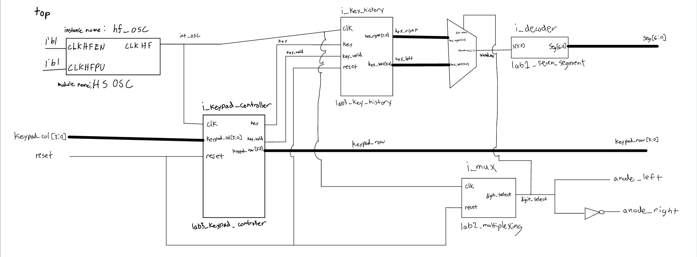{#fig-top_block fig-align="center"}

The block diagram shows the data and control flow through the design. The keypad columns enter the FPGA 
through the input synchronizer before being processed by the keypad scanner and key-detection logic. The 
scanner controls the keypad rows, while the detected row and column are decoded into a hexadecimal value.

The resulting key value is passed to the display logic, which maintains the two most recently accepted 
digits @fig-key-history-block and drives the dual seven-segment display @fig-multiplexing.

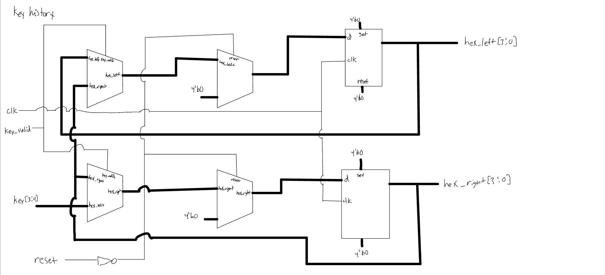{#fig-key-history-block fig-align="center"}

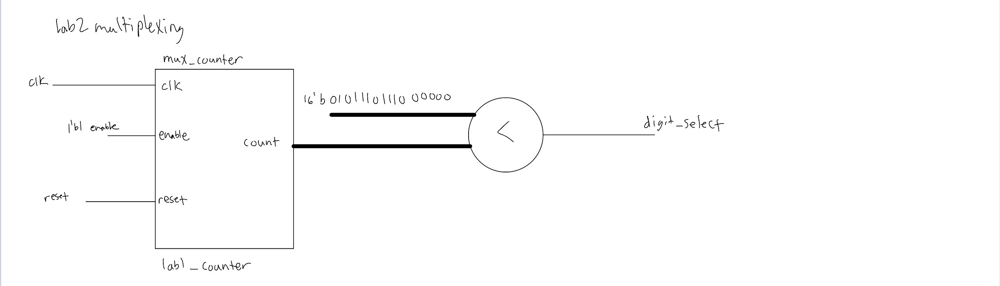{#fig-multiplexing fig-align="center"}


The block diagram is intended to be a 1:1 representation of the Verilog implementation. Each submodule 
is explicitly represented, and internal nets are labeled.

## Schematic

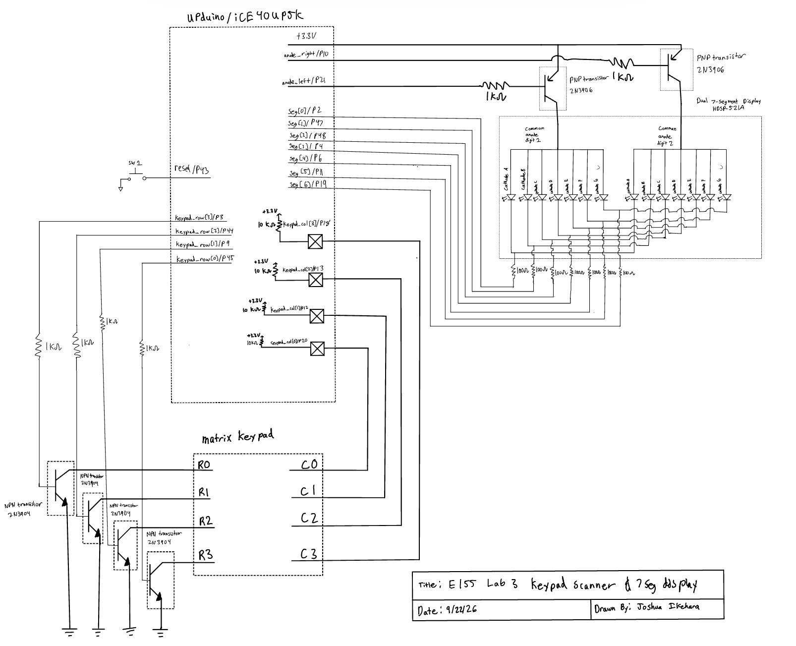{#fig-schematic fig-align="center"}

@fig-schematic shows the physical connection between the FPGA, keypad, and seven segment display hardware.

The schematic includes the external components required for the keypad and display interfaces. Internal FPGA 
components such as synchronizers, counters, FSMs, and seven-segment decoding logic are represented in the 
Verilog/block diagrams rather than as pysical components on the schematic. For resistor value calculations,
[resistor to PNP Transistor](../lab2/lab2.qmd#eq-rpnp), [resistor to LED](../lab2/lab2.qmd#eq-rled), and [resistor to NPN](../lab2/lab2.qmd#eq-rled).

## Finite State Machine Design

The keypad control logic is implemented as a finite state machine. The FSM separates the keypad scanning 
process from the conditions required to recognize a valid key press.

The FSM was designed using the canonical FSM structure discussed in lecture, with state registers, 
next-state logic, and output logic separated appropriately.

The FSM can be represented by the following diagram:

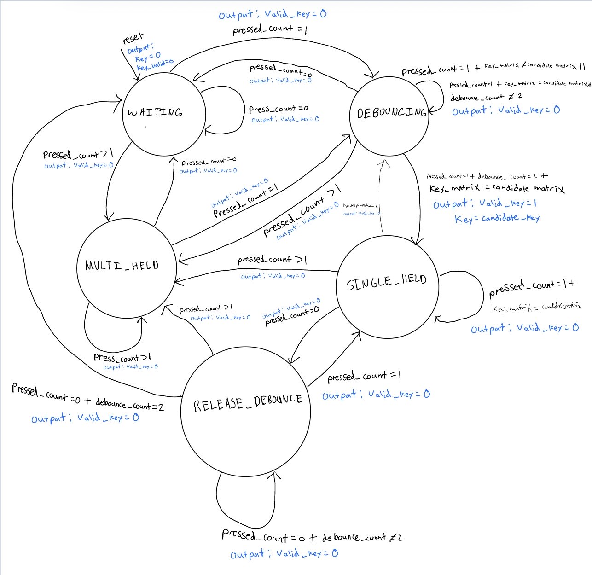{#fig-fsm-chart fig-align="center"}

Thus, the state transition table for our FSM is: 

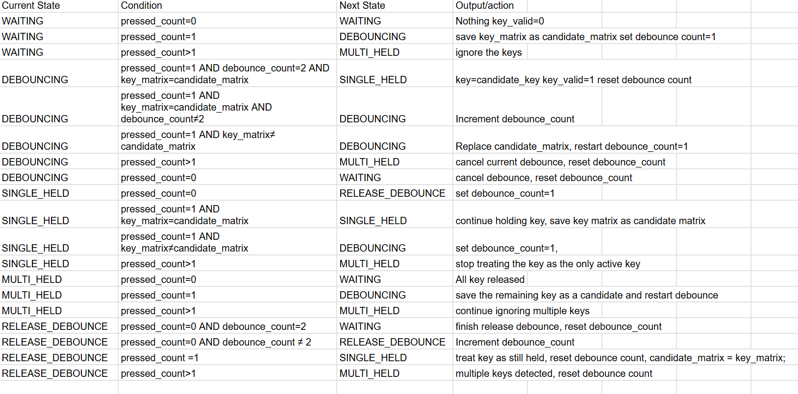{#fig-state-transition-table fig-align="center"}

The FSM only processes thes conditions when `scan_comlete` is asserted. Therefore, the state machine operates on a 
complete keypad scan rather than individual column changes. 

## debouncing strategy

The design performs debouncing at the keypad-controller level rather than using a continuously running high-frequency 
counter. The scanner produces a complete keypad matrix once every four-row scan. The FSM evaluates that matrix only 
when scan_complete is asserted.

For a new single-key candidate, the controller stores the entire sixteen-bit key_matrix in candidate_matrix. The 
candidate must remain identical for multiple complete scans before it is accepted.

This strategy provides two useful properties.

First, a short mechanical transition that disappears before the debounce requirement is satisfied does not produce
a valid key.

Second, the entire matrix is compared rather than only the decoded hexadecimal value. This ensures that a different 
physical key cannot accidentally be interpreted as continued activity from the original key.

The release of a key is also debounced using RELEASE_DEBOUNCE. This prevents a brief release caused by mechanical 
bounce from immediately enabling another key event.

A tradeoff of this approach is latency. Because the debounce decision is synchronized to complete keypad scans,
a valid key press may take several scans to become registered. The benefit is that the design remains synchronous 
and the debounce behavior is integrated directly with the keypad scanning process.

## Key mapping
The controller decodes each one-hot bit in the sixteen-bit keypad matrix into the corresponding hexadecimal
keypad value. The mapping is implementated as a combinational statement. If the matrix doesn't contain exactly one
recognized key pattern, the default value is 4'h0.

## Seven Segment Display History

The `lab3_key_history` module stores the two most recently accepted keys.

When `key_valid` is asserted:

hex_left  <= hex_right
hex_right <= key

Thus, the newest key appears on the right display and the previous key shifts to the left display.

The top-level module then selects either `hex_left` or `hex_right` based on the multiplexing signal. The seven-segment
decoder from Lab 1 converts the selected hexadecimal value to the seven-segment output.

The display multiplexing logic is reused from Lab 2. The two anode outputs are complementary, so only 
one display is selected at a time.


# Results and Discussion

The design met the prescribed Lab 3 requirements. The FPGA successfully scans the 4×4 keypad, registers individual 
key presses once, and displays the two most recently pressed hexadecimal digits on the dual seven-segment display. 
The design also implements input synchronization and debouncing and handles multiple-key conditions without displaying 
invalid intermediate values.

## Simulation
The testbenches were used to verify the individual modules as well as the complete top-level design. The synchronizer testbench checked asynchronous input transitions relative to the system clock, while the scanner testbench verified the four row outputs, column sampling, keypad matrix, and scan_complete signal. The keypad controller testbench exercised single key presses, held keys, switch bounce, multiple simultaneous keys, and recovery after multiple keys were released.
The uploaded design contains separate testbenches for the major new modules:

- tb_lab3_synchronizer

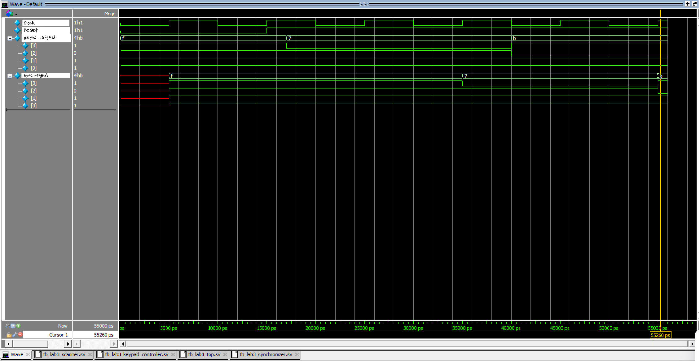{#fig-synchronizer fig-align="center"}

- tb_lab3_scanner

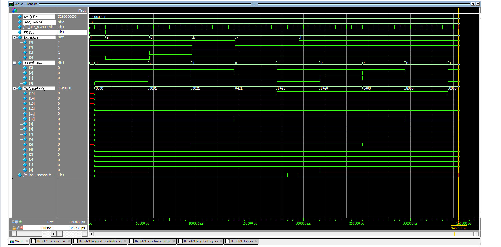{#fig-synchronizer fig-align="center"}

- tb_lab3_key_history

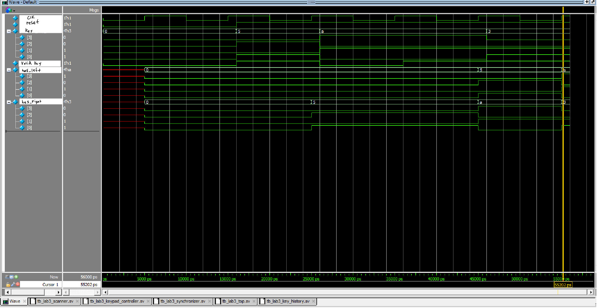{#fig-key-history fig-align="center"}

- tb_lab3_keypad_controller

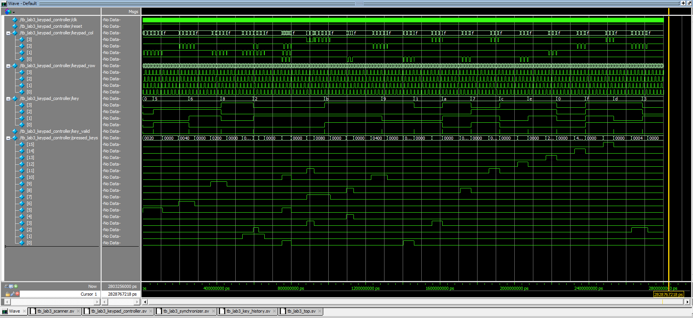{#fig-keypad-controller fig-align="center"}

- tb_lab3_top

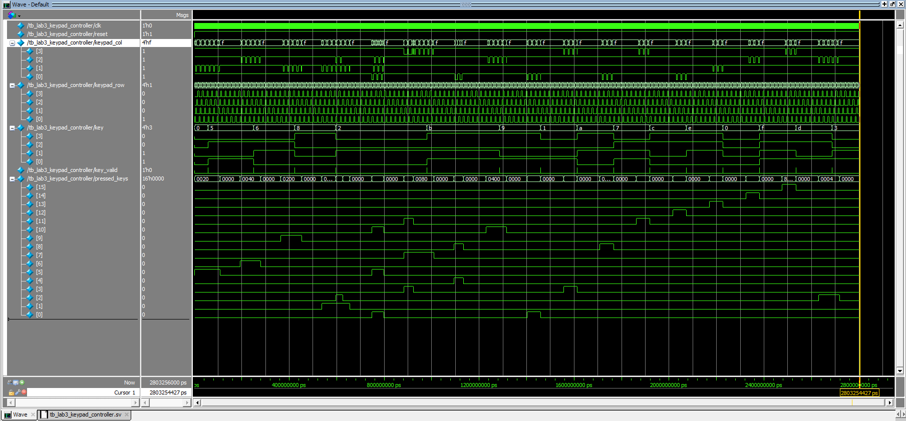{#fig-top fig-align="center"}

The testbenches use automatic tasks such as press_key, release_key, and wait_scans to make the keypad stimulus easier to construct.

The keypad testbench models the physical matrix by converting the set of pressed keys into active-low column signals based on the currently driven row.

## Synthesis Result

The synthesized design was inspected using Radiant synthesis report to demonstrate that the deign doesn't infer
latches or tri-state buffers. The combinationoal blcks use complete assignments and expliect case defaults,
while sequential state and storage are implemented with `always_ff`.

The Lattice synthesis report showed now latches or tristate buffers

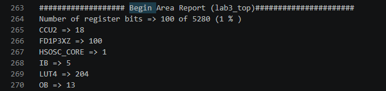{#fig-no_latches fig-align="center"}

# Conclusion

The Lab 3 design successfully implements a synchronous 4×4 keypad scanner with input synchronization, debouncing, multi-key handling, 
key history, and dual seven-segment display output. The design uses the required module structure and reuses the appropriate logic from previous labs. The testbenches exercise the major state transitions and keypad conditions required by the specification.

I spent approximately 24 hours working on this lab.

# AI prototype Summary

The modular prompting approach worked better for this lab because it allowed the keypad scanner, key registration FSM, and display logic to be developed and tested separately. 
The one prompt produced a reasonable starting design, but the decomposed prompts made the module boundaries and FSM behavior easier to understand and debug. One issue I encountered was 
making the active-low keypad signals and key mapping consistent across the modules. Overall, I found that giving the LLM smaller, well-defined design tasks produced code that was easier 
to verify and integrate. In future labs, I would use modular prompts first and then use the LLM to help integrate and debug the individual modules.


```{.systemverilog}
// Keypad Controller with single-press registration and state machine
module keypad_decoder (
    input  logic       clk_scan,   // Slow clock (~100-200 Hz)
    input  logic       rst_n,      // Active-low asynchronous reset
    input  logic [3:0] row,        // Active-low inputs from keypad rows (pull-ups enabled)
    output logic [3:0] col,        // Active-low outputs driving keypad columns
    output logic [3:0] key_code,   // 4-bit hex code of registered key
    output logic       key_valid   // 1-cycle pulse when a new key press is registered
);

    typedef enum logic [1:0] {
        SCAN,
        DEBOUNCE_WAIT,
        WAIT_RELEASE
    } state_t;

    state_t state;
    logic [1:0] col_idx;

    // Driving active-low column scan
    always_comb begin
        col = 4'b1111;
        col[col_idx] = 1'b0;
    end

    // Map active-low row/col state to hex value
    function automatic logic [3:0] decode_key(input logic [1:0] c, input logic [3:0] r);
        case ({c, r})
            // Col 0
            {2'd0, 4'b0111}: decode_key = 4'h1;
            {2'd0, 4'b1011}: decode_key = 4'h4;
            {2'd0, 4'b1101}: decode_key = 4'h7;
            {2'd0, 4'b1110}: decode_key = 4'h0;
            // Col 1
            {2'd1, 4'b0111}: decode_key = 4'h2;
            {2'd1, 4'b1011}: decode_key = 4'h5;
            {2'd1, 4'b1101}: decode_key = 4'h8;
            {2 me 1, 4'b1110}: decode_key = 4'hF;
            // Col 2
            {2'd2, 4'b0111}: decode_key = 4'h3;
            {2'd2, 4'b1011}: decode_key = 4'h6;
            {2'd2, 4'b1101}: decode_key = 4'h9;
            {2'd2, 4'b1110}: decode_key = 4'hE;
            // Col 3
            {2'd3, 4'b0111}: decode_key = 4'hA;
            {2'd3, 4'b1011}: decode_key = 4'hB;
            {2'd3, 4'b1101}: decode_key = 4'hC;
            {2'd3, 4'b1110}: decode_key = 4'hD;
            default:        decode_key = 4'h0;
        endcase
    endfunction

    always_ff @(posedge clk_scan or negedge rst_n) begin
        if (!rst_n) begin
            state     <= SCAN;
            col_idx   <= '0;
            key_code  <= '0;
            key_valid <= 1'b0;
        end else begin
            key_valid <= 1'b0; // Default pulse output

            case (state)
                SCAN: begin
                    // If any row bit is pulled low, a key is pressed
                    if (row != 4'b1111) begin
                        key_code  <= decode_key(col_idx, row);
                        key_valid <= 1'b1;
                        state     <= DEBOUNCE_WAIT;
                    end else begin
                        col_idx <= col_idx + 1'b1; // Keep scanning
                    end
                end

                DEBOUNCE_WAIT: begin
                    // Extra clock frame stabilization before waiting for release
                    state <= WAIT_RELEASE;
                end

                WAIT_RELEASE: begin
                    // Stay in this state until ALL keys across all columns are released
                    if (row == 4'b1111) begin
                        state   <= SCAN;
                        col_idx <= col_idx + 1'b1;
                    end
                end

                default: state <= SCAN;
            endcase
        end
    end

endmodule

// Dual 7-segment Display Driver (Common Anode assumed: Segments Active-Low)
module display_mux (
    input  logic       clk_fast,    // Fast clock (~20 MHz HFOSC)
    input  logic       rst_n,
    input  logic [3:0] digit_high,  // Older key digit
    input  logic [3:0] digit_low,   // Most recent key digit
    output logic [6:0] seg,         // Segment drivers {a, b, c, d, e, f, g} (Active-Low)
    output logic [1:0] digit_select // Digit digit select drivers (Active-Low)
);

    // Refresh rate counter (~500 Hz display toggle rate from 20 MHz)
    // 20 MHz / 2^14 ≈ 1220 Hz cycle rate (610 Hz refresh per digit)
    logic [13:0] refresh_counter;
    logic        disp_select;

    always_ff @(posedge clk_fast or negedge rst_n) begin
        if (!rst_n)
            refresh_counter <= '0;
        else
            refresh_counter <= refresh_counter + 1'b1;
    end

    assign disp_select = refresh_counter[13];

    // Select raw hex digit for current active channel
    logic [3:0] current_hex;
    always_comb begin
        if (disp_select) begin
            digit_select = 2'b10; // Active-Low enable for Digit 1 (High)
            current_hex  = digit_high;
        end else begin
            digit_select = 2'b01; // Active-Low enable for Digit 0 (Low)
            current_hex  = digit_low;
        end
    end

    // Hex to Active-Low 7-Segment Decoder
    // Segments: {a, b, c, d, e, f, g}
    always_comb begin
        case (current_hex)
            4'h0: seg = 7'b000_0001;
            4'h1: seg = 7'b100_1111;
            4'h2: seg = 7'b001_0010;
            4'h3: seg = 7'b000_0110;
            4'h4: seg = 7'b100_1100;
            4'h5: seg = 7'b010_0100;
            4'h6: seg = 7'b010_0000;
            4'h7: seg = 7'b000_1111;
            4'h8: seg = 7'b000_0000;
            4'h9: seg = 7'b000_0100;
            4'hA: seg = 7'b000_1000;
            4'hB: seg = 7'b110_0000;
            4'hC: seg = 7'b011_0001;
            4'hD: seg = 7'b100_0010;
            4'hE: seg = 7'b011_0000;
            4'hF: seg = 7'b011_1000;
            default: seg = 7'b111_1111;
        endcase
    end

endmodule
module top_keypad_display (
    input  logic       rst_n,        // External active-low reset
    input  logic [3:0] key_row,      // Keypad rows (active-low with pull-ups)
    output logic [3:0] key_col,      // Keypad columns (active-low output)
    output logic [6:0] seg_out,      // Display segments active-low {a,b,c,d,e,f,g}
    output logic [1:0] digit_sel_out // Active-low digit selects
);

    // ------------------------------------------------------------------------
    // 1. Lattice iCE40 High-Speed Internal Oscillator Primitive instantiation
    // ------------------------------------------------------------------------
    logic clk_20mhz;

    SB_HFOSC #(
        .CLKHF_DIV("0b01") // Divides internal 48MHz clock by 2 to yield ~24MHz/20MHz nominal
    ) u_hfosc (
        .CLKHFPU(1'b1),    // Power-up oscillator
        .CLKHFEN(1 me 1),    // Enable clock output
        .CLKHF(clk_20mhz)  // Clock output
    );

    // ------------------------------------------------------------------------
    // 2. Synchronous Clock Divider (20 MHz -> ~152 Hz)
    // ------------------------------------------------------------------------
    // 20 MHz / 2^17 = ~152.5 Hz scan clock frequency
    logic [16:0] clk_div;
    logic        clk_scan;

    always_ff @(posedge clk_20mhz or negedge rst_n) begin
        if (!rst_n)
            clk_div <= '0;
        else
            clk_div <= clk_div + 1'b1;
    end

    assign clk_scan = clk_div[16];

    // ------------------------------------------------------------------------
    // 3. Keypad Matrix Controller Instantiation
    // ------------------------------------------------------------------------
    logic [3:0] key_code;
    logic       key_valid;

    keypad_decoder u_keypad (
        .clk_scan (clk_scan),
        .rst_n    (rst_n),
        .row      (key_row),
        .col      (key_col),
        .key_code (key_code),
        .key_valid(key_valid)
    );

    // ------------------------------------------------------------------------
    // 4. Shift Register logic for Last Two Key Presses
    // ------------------------------------------------------------------------
    logic [3:0] digit_high; // Older key
    logic [3:0] digit_low;  // Most recent key

    always_ff @(posedge clk_20mhz or negedge rst_n) begin
        if (!rst_n) begin
            digit_high <= 4'h0;
            digit_low  <= 4'h0;
        end else if (key_valid) begin
            digit_high <= digit_low; // Shift previous key left
            digit_low  <= key_code;  // Register newest key
        end
    end

    // ------------------------------------------------------------------------
    // 5. Multiplexed Display Driver
    // ------------------------------------------------------------------------
    display_mux u_display (
        .clk_fast    (clk_20mhz),
        .rst_n       (rst_n),
        .digit_high  (digit_high),
        .digit_low   (digit_low),
        .seg         (seg_out),
        .digit_select(digit_sel_out)
    );

endmodule
```

the module prompting resulted in this 
```{.systemverilog}
module keypad_oneshot_scanner #(
    parameter int CLK_FREQ_HZ = 12_000_000, // Default 12 MHz SB_HFOSC clock
    parameter int DEBOUNCE_MS = 10           // 10 ms debounce time
) (
    input  logic       clk,
    input  logic       rst_n,
    
    // Keypad Hardware Interface
    // Rows driven as active-low outputs (weak pull-ups on hardware or internal)
    output logic [3:0] row,
    // Cols read as active-low inputs (requires internal/external pull-ups)
    input  logic [3:0] col,
    
    // Output Interface
    output logic [3:0] key_code,   // 0x0..0xF corresponding to the pressed key
    output logic       key_valid   // Single-cycle high pulse when a valid key is registered
);

    // =========================================================================
    // 1. Clock Enable / Debounce Timer Generation (~1 ms pulse)
    // =========================================================================
    localparam int CLK_DIV_COUNT = CLK_FREQ_HZ / 1000;
    
    logic [$clog2(CLK_DIV_COUNT)-1:0] clk_div_cnt;
    logic                             tick_1ms;

    always_ff @(posedge clk or negedge rst_n) begin
        if (!rst_n) begin
            clk_div_cnt <= '0;
            tick_1ms    <= 1'b0;
        end else begin
            if (clk_div_cnt == CLK_DIV_COUNT - 1) begin
                clk_div_cnt <= '0;
                tick_1ms    <= 1'b1;
            end else begin
                clk_div_cnt <= clk_div_cnt + 1'b1;
                tick_1ms    <= 1 meb0;
            end
        end
    end

    // Debounce Counter (counts 1 ms ticks)
    logic [$clog2(DEBOUNCE_MS):0] debounce_cnt;
    logic                         debounce_timer_done;

    assign debounce_timer_done = (debounce_cnt >= DEBOUNCE_MS);

    // =========================================================================
    // 2. Column Input Synchronizer (prevents metastability from asynchronous inputs)
    // =========================================================================
    logic [3:0] col_sync_0, col_sync_1;

    always_ff @(posedge clk or negedge rst_n) begin
        if (!rst_n) begin
            col_sync_0 <= 4'b1111;
            col_sync_1 <= 4'b1111;
        end else begin
            col_sync_0 <= col;
            col_sync_1 <= col_sync_0;
        end
    end

    // Detect if any column is active (active low -> col_sync_1 != 4'b1111)
    logic any_col_pressed;
    assign any_col_pressed = (col_sync_1 != 4'b1111);

    // =========================================================================
    // 3. FSM State Definitions & Registers
    // =========================================================================
    typedef enum logic [2:0] {
        ST_INIT_SCAN    = 3'b000,
        ST_SCAN         = 3'b001,
        ST_DEBOUNCE_DN  = 3'b010,
        ST_REGISTER_KEY = 3'b011,
        ST_WAIT_RELEASE = 3'b100,
        ST_DEBOUNCE_UP  = 3'b101
    } state_t;

    state_t state, next_state;

    // Row selection and current row tracking
    logic [1:0] row_idx;
    logic [3:0] row_reg;
    assign row = row_reg;

    // Decode pressed column index to binary value (0 to 3)
    logic [1:0] col_idx;
    always_comb begin
        case (col_sync_1)
            4'b1110: col_idx = 2'd0;
            4'b1101: col_idx = 2'd1;
            4'b1011: col_idx = 2'd2;
            4'b0111: col_idx = 2'd3;
            default: col_idx = 2'd0;
        endcase
    end

    // Drive rows active-low (1-hot low logic)
    always_comb begin
        case (row_idx)
            2'd0:    row_reg = 4'b1110;
            2'd1:    row_reg = 4'b1101;
            2'd2:    row_reg = 4'b1011;
            2'd3:    row_reg = 4'b0111;
            default: row_reg = 4'b0000; // Drive all rows low during release-check
        endcase
    end

    // Output Registers for Registered Hex Code & Single-Pulse Valid
    logic [3:0] key_code_reg;
    logic       key_valid_reg;

    assign key_code  = key_code_reg;
    assign key_valid = key_valid_reg;

    // =========================================================================
    // 4. FSM Sequential Logic
    // =========================================================================
    always_ff @(posedge clk or negedge rst_n) begin
        if (!rst_n) begin
            state        <= ST_INIT_SCAN;
            row_idx      <= '0;
            debounce_cnt <= '0;
            key_code_reg  <= '0;
            key_valid_reg <= 1'b0;
        end else begin
            state         <= next_state;
            key_valid_reg <= 1'b0; // Default: single-cycle pulse

            // Debounce counter administration
            if (state == ST_DEBOUNCE_DN || state == ST_DEBOUNCE_UP) begin
                if (tick_1ms && !debounce_timer_done) begin
                    debounce_cnt <= debounce_cnt + 1'b1;
                end
            end else begin
                debounce_cnt <= '0;
            end

            // Row scanning sequence
            if (state == ST_SCAN && !any_col_pressed) begin
                row_idx <= row_idx + 1'b1;
            end

            // Capture Key Code on registration
            if (state == ST_SCAN && any_col_pressed) begin
                // Map (Row, Col) to 0x0-0xF hex value: key = (row * 4) + col
                key_code_reg <= {row_idx, col_idx};
            end

            // Assert one-shot pulse cleanly from registered state
            if (state == ST_REGISTER_KEY) begin
                key_valid_reg <= 1'b1;
            end
        end
    end

    // =========================================================================
    // 5. FSM Next-State Combinational Logic
    // =========================================================================
    always_comb begin
        next_state = state;

        case (state)
            // Initialize scanning
            ST_INIT_SCAN: begin
                next_state = ST_SCAN;
            end

            // Sequentially drive row low and sample column response
            ST_SCAN: begin
                if (any_col_pressed) begin
                    next_state = ST_DEBOUNCE_DN;
                end
            end

            // Wait for key-press mechanical bounce to settle
            ST_DEBOUNCE_DN: begin
                if (debounce_timer_done) begin
                    if (any_col_pressed) begin
                        next_state = ST_REGISTER_KEY;
                    end else begin
                        next_state = ST_SCAN; // False trigger / glitch
                    end
                end
            end

            // Single cycle output state to issue key_valid
            ST_REGISTER_KEY: begin
                next_state = ST_WAIT_RELEASE;
            end

            // Hold off accepting new key presses until all keys are released
            ST_WAIT_RELEASE: begin
                if (!any_col_pressed) begin
                    next_state = ST_DEBOUNCE_UP;
                end
            end

            // Wait for key-release mechanical bounce to settle
            ST_DEBOUNCE_UP: begin
                if (debounce_timer_done) begin
                    if (!any_col_pressed) begin
                        next_state = ST_INIT_SCAN; // Fully released, ready for new key
                    end else begin
                        next_state = ST_WAIT_RELEASE; // Still bouncing or held
                    end
                end
            end

            default: next_state = ST_INIT_SCAN;
        endcase
    end

endmodule
module keypad_matrix_scanner #(
    parameter int CLK_FREQ_HZ = 12_000_000, // Default 12 MHz SB_HFOSC
    parameter int SCAN_RATE_HZ = 1000        // Column scan rate per column step (1 kHz)
) (
    input  logic       clk,
    input  logic       rst_n,

    // Hardware Interface to Keypad
    // Driven as 1-hot active-low outputs
    output logic [3:0] col,
    // Read as active-low inputs (requires weak internal or external pull-ups)
    input  logic [3:0] row,

    // Decoded Outputs
    output logic [3:0] key_code,   // Stable 4-bit hex code (0x0..0xF)
    output logic       key_pressed // High while ANY valid single key is held down
);

    // =========================================================================
    // 1. Scan Clock Divider (Derives ~1 kHz tick for column stepping)
    // =========================================================================
    localparam int CLK_DIV_COUNT = CLK_FREQ_HZ / SCAN_RATE_HZ;
    
    logic [$clog2(CLK_DIV_COUNT)-1:0] scan_div_cnt;
    logic                             scan_tick;

    always_ff @(posedge clk or negedge rst_n) begin
        if (!rst_n) begin
            scan_div_cnt <= '0;
            scan_tick    <= 1'b0;
        end else begin
            if (scan_div_cnt == CLK_DIV_COUNT - 1) begin
                scan_div_cnt <= '0;
                scan_tick    <= 1'b1;
            end else begin
                scan_div_cnt <= scan_div_cnt + 1'b1;
                scan_tick    <= 1'b0;
            end
        end
    end

    // =========================================================================
    // 2. Synchronize Row Inputs (Prevents metastability from asynchronous keys)
    // =========================================================================
    logic [3:0] row_sync_0, row_sync_1;

    always_ff @(posedge clk or negedge rst_n) begin
        if (!rst_n) begin
            row_sync_0 <= 4'b1111;
            row_sync_1 <= 4'b1111;
        end else begin
            row_sync_0 <= row;
            row_sync_1 <= row_sync_0;
        end
    end

    // =========================================================================
    // 3. Column Drive and State Machine
    // =========================================================================
    logic [1:0] col_idx; // Active column index (0 to 3)

    // Active-low drive: 1-hot zero driven to selected column
    always_comb begin
        case (col_idx)
            2'd0:    col = 4'b1110;
            2'd1:    col = 4'b1101;
            2 meb0:  col = 4'b1011; // 2'd2
            2'd3:    col = 4'b0111;
            default: col = 4'b1111;
        endcase
    end

    // Decode active-low row input to 2-bit binary index
    logic [1:0] row_idx;
    logic       row_active;

    always_comb begin
        case (row_sync_1)
            4'b1110: begin row_idx = 2'd0; row_active = 1'b1; end
            4'b1101: begin row_idx = 2'd1; row_active = 1'b1; end
            4'b1011: begin row_idx = 2'd2; row_active = 1'b1; end
            4'b0111: begin row_idx = 2'd3; row_active = 1'b1; end
            default: begin row_idx = 2'd0; row_active = 1'b0; end // Multikey or idle
        endcase
    end

    // Standard Matrix Layout Mapping: Key = (Row * 4) + Col
    // Standard 4x4 layout mapping table:
    // [0,1,2,3] -> 0x1, 0x2, 0x3, 0xA
    // [4,5,6,7] -> 0x4, 0x5, 0x6, 0xB
    // [8,9,A,B] -> 0x7, 0x8, 0x9, 0xC
    // [C,D,E,F] -> 0xE (*), 0x0, 0xF (#), 0xD
    logic [3:0] mapped_key;

    always_comb begin
        case ({row_idx, col_idx})
            4'h0: mapped_key = 4'h1; // R0C0 -> '1'
            4'h1: mapped_key = 4'h2; // R0C1 -> '2'
            4'h2: mapped_key = 4'h3; // R0C2 -> '3'
            4'h3: mapped_key = 4'hA; // R0C3 -> 'A'

            4'h4: mapped_key = 4'h4; // R1C0 -> '4'
            4'h5: mapped_key = 4'h5; // R1C1 -> '5'
            4'h6: mapped_key = 4'h6; // R1C2 -> '6'
            4'h7: mapped_key = 4'hB; // R1C3 -> 'B'

            4'h8: mapped_key = 4'h7; // R2C0 -> '7'
            4'h9: mapped_key = 4'h8; // R2C1 -> '8'
            4'hA: mapped_key = 4'h9; // R2C2 -> '9'
            4'hB: mapped_key = 4'hC; // R2C3 -> 'C'

            4'hC: mapped_key = 4'hE; // R3C0 -> '*' mapped to 0xE
            4'hD: mapped_key = 4'h0; // R3C1 -> '0'
            4'hE: mapped_key = 4'hF; // R3C2 -> '#' mapped to 0xF
            4'hF: mapped_key = 4'hD; // R3C3 -> 'D'
            default: mapped_key = 4'h0;
        endcase
    end

    // =========================================================================
    // 4. Sequential Key Hold & Scan Logic
    // =========================================================================
    logic [3:0] key_code_reg;
    logic       key_pressed_reg;

    assign key_code    = key_code_reg;
    assign key_pressed = key_pressed_reg;

    always_ff @(posedge clk or negedge rst_n) begin
        if (!rst_n) begin
            col_idx         <= '0;
            key_code_reg    <= '0;
            key_pressed_reg <= 1'b0;
        end else begin
            if (row_active) begin
                // Key detected: Freeze column scanning, capture code, and assert key_pressed
                key_code_reg    <= mapped_key;
                key_pressed_reg <= 1'b1;
            end else if (scan_tick) begin
                // No key on current column: advance column scanner
                col_idx         <= col_idx + 1'b1;
                key_pressed_reg <= 1'b0;
            end
        end
    end

endmodule

module top_keypad_display (
    // Keypad Hardware Interface
    output logic [3:0] keypad_col, // Active-low column outputs
    input  logic [3:0] keypad_row, // Active-low row inputs (pull-ups enabled in PCF)

    // Dual 7-Segment Display Interface
    output logic [6:0] seg,        // Cathodes A-G (Active-Low)
    output logic [1:0] digit_sel   // Anodes/Digit Select (Active-High)
);

    // =========================================================================
    // 1. iCE40 UP5K Internal High-Frequency Oscillator (SB_HFOSC)
    // =========================================================================
    // Configured for 12 MHz clock output (CLKHFDIV = "0b10" -> 48MHz / 4 = 12MHz)
    logic clk_12mhz;

    SB_HFOSC #(
        .CLKHF_DIV("0b10")
    ) u_hfosc (
        .CLKHFPU(1'b1),
        .CLKHFEN(1'b1),
        .CLKHF  (clk_12mhz)
    );

    // =========================================================================
    // 2. Power-On Reset Generator (POR)
    // =========================================================================
    // Generates a synchronous active-low reset for ~16 clock cycles after startup
    logic [3:0] rst_cnt = 4'b0000;
    logic       rst_n;

    assign rst_n = (rst_cnt == 4'b1111);

    always_ff @(posedge clk_12mhz) begin
        if (!rst_n) begin
            rst_cnt <= rst_cnt + 1'b1;
        end
    end

    // =========================================================================
    // 3. Submodule Interconnects
    // =========================================================================
    logic [3:0] scan_key_code;
    logic       scan_key_pressed;

    logic [3:0] reg_key_code;
    logic       key_valid_pulse;

    // Shift Register Digits
    logic [3:0] digit_most_recent; // Digit 0 (Right/Newest)
    logic [3:0] digit_older;       // Digit 1 (Left/Older)

    // =========================================================================
    // 4. Instantiations: Keypad Scanner & One-Shot Debouncer
    // =========================================================================

    // Continuous Matrix Scanner
    keypad_matrix_scanner #(
        .CLK_FREQ_HZ(12_000_000),
        .SCAN_RATE_HZ(1000)
    ) u_scanner (
        .clk        (clk_12mhz),
        .rst_n      (rst_n),
        .col        (keypad_col),
        .row        (keypad_row),
        .key_code   (scan_key_code),
        .key_pressed(scan_key_pressed)
    );

    // Debouncer & Single-Cycle Pulse Registration
    keypad_oneshot_scanner #(
        .CLK_FREQ_HZ(12_000_000),
        .DEBOUNCE_MS(10)
    ) u_oneshot (
        .clk        (clk_12mhz),
        .rst_n      (rst_n),
        .col        (keypad_col),
        .row        (keypad_row),
        .key_code   (reg_key_code),
        .key_valid  (key_valid_pulse)
    );

    // =========================================================================
    // 5. Shift Register Logic (Older ← Most Recent ← New Key)
    // =========================================================================
    always_ff @(posedge clk_12mhz or negedge rst_n) begin
        if (!rst_n) begin
            digit_most_recent <= 4'h0;
            digit_older       <= 4'h0;
        end else if (key_valid_pulse) begin
            // Shift older key left, capture new key into right digit
            digit_older       <= digit_most_recent;
            digit_most_recent <= reg_key_code;
        end
    end

    // =========================================================================
    // 6. Display Multiplexing & MUX Clock Divider (~200 Hz multiplex rate)
    // =========================================================================
    // 12 MHz / 60,000 = 200 Hz overall multiplex refresh (~100 Hz per digit)
    localparam int MUX_DIV_COUNT = 12_000_000 / 200;

    logic [$clog2(MUX_DIV_COUNT)-1:0] mux_cnt;
    logic                             mux_digit_select; // 0 = Digit 0, 1 = Digit 1

    always_ff @(posedge clk_12mhz or negedge rst_n) begin
        if (!rst_n) begin
            mux_cnt          <= '0;
            mux_digit_select <= 1'b0;
        end else begin
            if (mux_cnt == MUX_DIV_COUNT - 1) begin
                mux_cnt          <= '0;
                mux_digit_select <= ~mux_digit_select; // Toggle active digit
            end else begin
                mux_cnt <= mux_cnt + 1'b1;
            end
        end
    end

    // Equal Duty Cycle Anode Drive (50% per digit)
    always_ff @(posedge clk_12mhz or negedge rst_n) begin
        if (!rst_n) begin
            digit_sel <= 2'b00;
        end else begin
            // Active-high digit select: Digit 0 (Right), Digit 1 (Left)
            digit_sel <= mux_digit_select ? 2'b10 : 2'b01;
        end
    end

    // Select 4-bit nibble for active digit
    logic [3:0] active_nibble;

    always_comb begin
        active_nibble = mux_digit_select ? digit_older : digit_most_recent;
    end

    // =========================================================================
    // 7. Seven Segment Decoder Instantiation
    // =========================================================================
    sevenSegment u_sevenSegment (
        .hex_digit(active_nibble),
        .segments (seg)
    );

endmodule
```